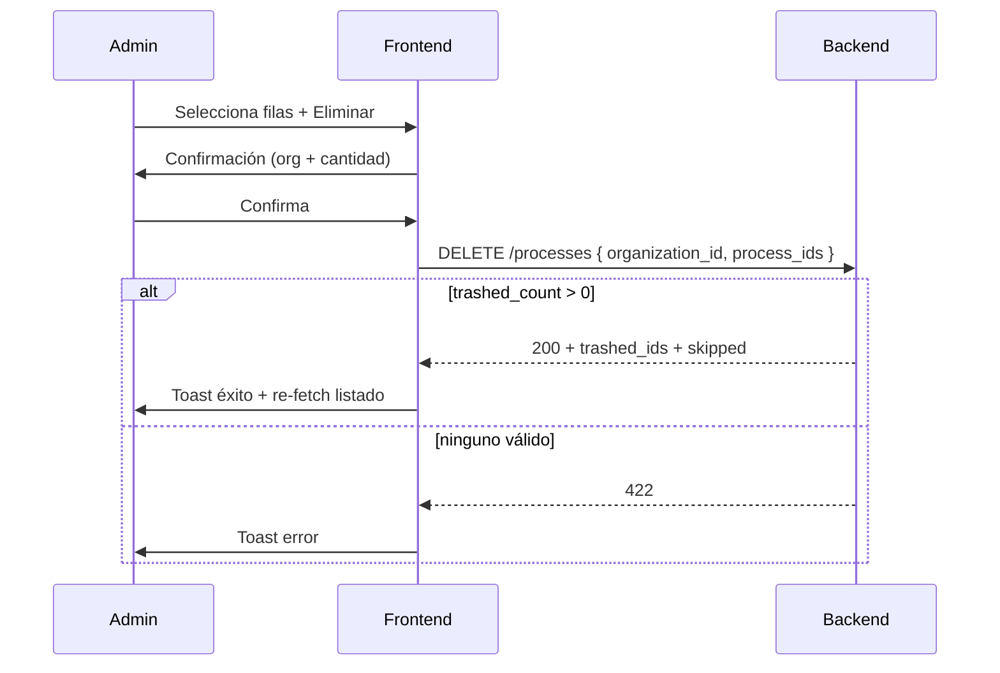

# Frontend Admin — Prompt: Eliminar procesos (papelera)

Prompt listo para el equipo / agente de frontend del **admin** de NotiJudicial.

---

## Objetivo

En la pantalla de **Procesos** del admin:

1. Poder **seleccionar uno, varios o todos** (de la página) con checkboxes.
2. Poder **eliminar** desde el **detalle** del proceso.
3. La eliminación debe ser a **papelera** (soft-delete del vínculo org ↔ proceso), no borrado permanente del radicado.

**Importante:** un proceso puede pertenecer a varias organizaciones. “Eliminar” solo quita el seguimiento de **la organización del contexto**. Otras orgs no se afectan. El proceso maestro (actuaciones, sujetos, etc.) **no se borra**.

**Fuera de alcance en este ticket:** listar papelera, restaurar, borrado permanente.

---

## Auth

```http
Authorization: Bearer {token}
```

- Usuario admin
- Base path: `/api/admin`

---

## Endpoints

### 1) Eliminar varios (listado + checkboxes)

```http
DELETE /api/admin/processes
Content-Type: application/json

{
  "organization_id": "uuid-organizacion",
  "process_ids": [
    "uuid-proceso-1",
    "uuid-proceso-2"
  ]
}
```

| Campo | Tipo | Reglas |
|-------|------|--------|
| `organization_id` | `string` (UUID) | **Obligatorio.** Org desde la cual se “elimina” |
| `process_ids` | `string[]` | **Obligatorio.** Mínimo 1. UUID de **instancia** (`id`), no el número de radicado |

#### Response 200

```json
{
  "message": "El proceso se envió a la papelera.",
  "trashed_count": 2,
  "trashed_ids": ["uuid-proceso-1", "uuid-proceso-2"],
  "skipped": [
    {
      "process_id": "uuid-ya-en-papelera",
      "reason": "already_trashed"
    },
    {
      "process_id": "uuid-sin-vinculo",
      "reason": "not_linked"
    }
  ]
}
```

| Campo | Descripción |
|-------|-------------|
| `trashed_count` | Cuántos se enviaron a papelera |
| `trashed_ids` | IDs efectivamente eliminados (soft) |
| `skipped` | IDs que no se pudieron eliminar y por qué |

| `skipped.reason` | Significado | UI sugerida |
|------------------|-------------|-------------|
| `already_trashed` | Ya estaba en papelera para esa org | “Ya estaba en papelera” |
| `not_linked` | Ese proceso no está vinculado a esa org | “No pertenece a esta organización” |

#### Errores

| Status | Cuándo |
|--------|--------|
| `401` | Sin auth |
| `422` | Validación (`organization_id` / `process_ids`) **o** ninguno se pudo enviar a papelera (`trash_nothing_trashed`) |
| `403` | No es admin |

---

### 2) Eliminar uno (detalle del proceso)

```http
DELETE /api/admin/processes/{processId}
Content-Type: application/json

{
  "organization_id": "uuid-organizacion"
}
```

`{processId}` = UUID de la instancia que se está viendo en el detalle.

#### Response 200

```json
{
  "message": "El proceso se envió a la papelera.",
  "trashed_count": 1,
  "trashed_ids": ["uuid-proceso"]
}
```

#### Errores

| Status | Cuándo |
|--------|--------|
| `404` | El proceso no está vinculado a esa org, o ya está en papelera |
| `422` | Falta / inválido `organization_id` |

---

## Cómo armar `process_ids` en el listado agrupado

El listado admin agrupa por radicado y puede traer `instances[]`.

| Caso | Qué enviar |
|------|------------|
| Fila sin múltiples instancias | El `id` de la fila |
| Fila con `instances` y el usuario selecciona la fila padre | **Todos** los `instances[].id` |
| Usuario selecciona una instancia concreta del dropdown | Solo ese `instances[i].id` |
| “Seleccionar todos” de la página | Todos los ids visibles según las reglas de arriba |

No enviar `process_number` (23 dígitos). Solo UUIDs.

---

## `organization_id` (obligatorio)

El backend necesita saber **de qué organización** se elimina.

Opciones de UI (elige la que encaje con la pantalla actual):

1. **Filtro de organización activo** en el listado → usar ese UUID.
2. Si no hay filtro: **modal/select** “¿De qué organización deseas eliminar?” antes de confirmar.
3. En detalle: usar la org del contexto (`?organization_id=` o la seleccionada en `organizations.items`).

Sin `organization_id` el request falla.

---

## Flujo UI



### Listado

1. Columna de checkbox por fila + “seleccionar todos” (página actual).
2. Botón **Eliminar** (o icono papelera) habilitado solo con selección ≥ 1.
3. Modal de confirmación, por ejemplo:

   > Se enviarán a papelera **{N}** proceso(s) de **{nombre organización}**.  
   > Podrán restaurarse después. Otras organizaciones no se verán afectadas.

4. Llamar `DELETE /api/admin/processes`.
5. Toast: `message` + `trashed_count`. Si hay `skipped`, mostrar resumen.
6. Re-fetch del listado (o quitar filas cuyo `id` esté en `trashed_ids`).

### Detalle

1. Botón **Eliminar** / icono papelera.
2. Misma confirmación (1 proceso + nombre de org).
3. `DELETE /api/admin/processes/{id}` con body `{ organization_id }`.
4. Éxito → volver al listado o recargar detalle (esa org ya no vendrá en `organizations.items`).
5. `404` → toast “No se encontró el vínculo con esta organización”.

---

## Tipos TypeScript

```typescript
type TrashSkippedReason = 'already_trashed' | 'not_linked';

type TrashProcessesPayload = {
  organization_id: string;
  process_ids: string[];
};

type TrashProcessPayload = {
  organization_id: string;
};

type TrashProcessesResponse = {
  message: string;
  trashed_count: number;
  trashed_ids: string[];
  skipped?: Array<{
    process_id: string;
    reason: TrashSkippedReason;
  }>;
};
```

### Ejemplo de llamadas

```typescript
// Bulk
await api.delete<TrashProcessesResponse>('/admin/processes', {
  data: {
    organization_id: orgId,
    process_ids: selectedIds,
  },
});

// Detalle
await api.delete<TrashProcessesResponse>(`/admin/processes/${processId}`, {
  data: { organization_id: orgId },
});
```

(Axios envía body en `DELETE` con `data`. Si el cliente HTTP no lo permite, usar el mismo contrato vía el helper que ya use el proyecto.)

---

## Comportamiento de producto (para copy / UX)

- No es “borrar el radicado del sistema”.
- Es “dejar de seguir este proceso en esta organización” y guardarlo en papelera.
- Cupo de radicados activos de esa org **se libera**.
- Sync / consolidados / alertas de esa org **dejan de incluirlo**.
- Si más adelante lo vuelven a agregar a la misma org, el backend **restaura** el vínculo (no crea duplicado).
- Papelera visible / restaurar / borrar definitivo: **tickets futuros**.

---

## Checklist de implementación

- [ ] Checkbox por fila + seleccionar todos (página)
- [ ] Botón Eliminar visible solo con selección
- [ ] Confirmación con nombre de org y cantidad
- [ ] `organization_id` siempre presente (filtro, select o detalle)
- [ ] Bulk: `DELETE /api/admin/processes`
- [ ] Detalle: `DELETE /api/admin/processes/{id}`
- [ ] Si hay `instances`, enviar los UUID correctos
- [ ] Toast de éxito con `trashed_count`
- [ ] Manejar `skipped` y errores `422` / `404`
- [ ] Re-fetch o actualizar UI tras éxito

---

## Contacto backend

Si el listado no tiene `organization_id` claro en el filtro, coordinar cómo el admin elige la org antes de eliminar. El backend **no** elimina de todas las orgs en un solo click a propósito.
