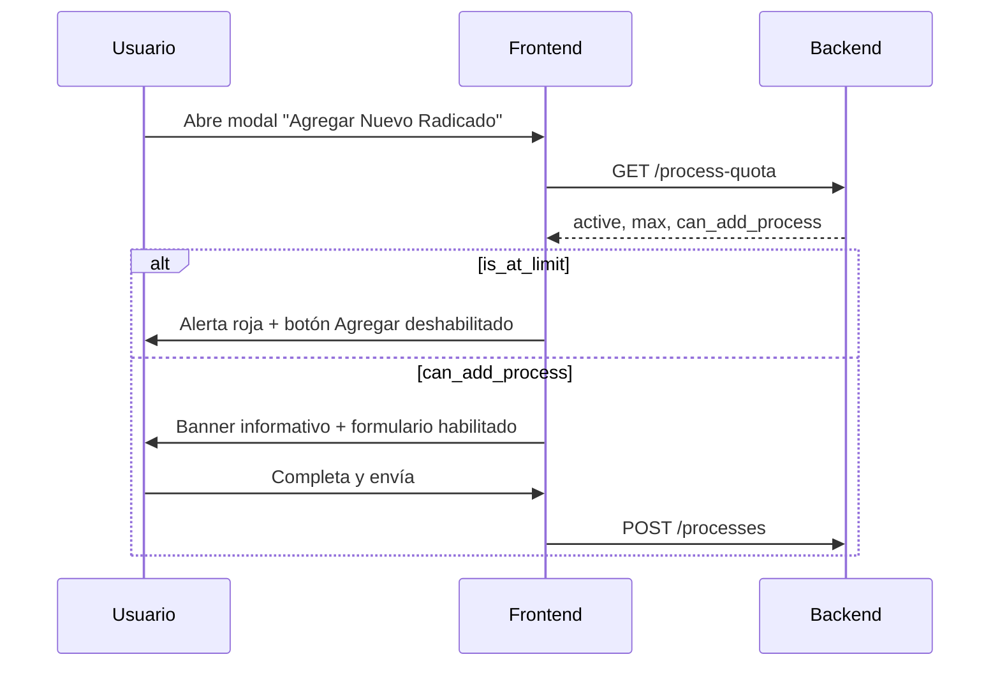

# Frontend App User — Cupo de radicados activos

Documento para integrar el **indicador de cupo** en la pantalla **Gestión de Procesos** y en el modal **Agregar Nuevo Radicado**.

---

## Objetivo

Mostrar **antes de intentar guardar** cuántos radicados activos tiene la organización, cuál es el límite y si ya llegó al tope — no depender solo del error 422 al enviar el formulario.

---

## Endpoint

```http
GET /api/app-user/process-quota
Authorization: Bearer {token}
```

- Usa la **organización activa** del usuario autenticado (no requiere `organizationId` en la URL).
- Requiere `auth:sanctum`.
- La org debe estar activa (middleware `app_user.organization_active`).

---

## Response 200

### Con límite configurado

```json
{
  "active_processes_count": 46,
  "max_active_processes": 46,
  "remaining_slots": 0,
  "is_unlimited": false,
  "is_at_limit": true,
  "can_add_process": false
}
```

### Con cupo disponible

```json
{
  "active_processes_count": 12,
  "max_active_processes": 60,
  "remaining_slots": 48,
  "is_unlimited": false,
  "is_at_limit": false,
  "can_add_process": true
}
```

### Sin límite (ilimitado)

```json
{
  "active_processes_count": 12,
  "max_active_processes": null,
  "remaining_slots": null,
  "is_unlimited": true,
  "is_at_limit": false,
  "can_add_process": true
}
```

---

## Campos

| Campo | Tipo | Uso en UI |
|-------|------|-----------|
| `active_processes_count` | `number` | Radicados activos actuales |
| `max_active_processes` | `number \| null` | Límite efectivo (`null` = ilimitado) |
| `remaining_slots` | `number \| null` | Cupos restantes (`null` si ilimitado) |
| `is_unlimited` | `boolean` | Ocultar barra de progreso / mensaje de límite |
| `is_at_limit` | `boolean` | Mostrar alerta roja y bloquear acción |
| `can_add_process` | `boolean` | Deshabilitar botón **Agregar** |

---

## Cuándo llamar al endpoint

1. **Al abrir** el modal “Agregar Nuevo Radicado”.
2. **Opcional:** al cargar la pantalla de Gestión de Procesos (badge/resumen en header).
3. **Tras agregar** un radicado con éxito → refrescar cupo.
4. **Tras activar/desactivar** un radicado → refrescar cupo.

---

## UI sugerida en el modal

### 1. Banner informativo (arriba del formulario)

**Si `is_unlimited === true`:** no mostrar banner de cupo (o solo “Radicados activos: 12”).

**Si hay límite:**

```text
Radicados activos: 46 de 46
```

Barra de progreso:

```text
porcentaje = (active_processes_count / max_active_processes) * 100
```

| Estado | Estilo |
|--------|--------|
| `< 80%` | Info / neutro (azul o gris) |
| `>= 80%` y no en límite | Advertencia (amarillo) |
| `is_at_limit === true` | Error (rojo) |

### 2. Mensaje cuando está en el límite

Usar el mismo copy del backend (422):

> La organización alcanzó el límite de {max_active_processes} radicados activos (actualmente {active_processes_count}). Desactive algún radicado o solicite ampliar el cupo.

Mostrarlo **antes** de que el usuario llene el formulario, no solo después del POST.

### 3. Botón Agregar

```typescript
disabled = !can_add_process || isSubmitting
```

Si `can_add_process === false`, el botón queda deshabilitado aunque el formulario sea válido.

### 4. Error 422 al guardar (fallback)

Si el usuario intenta agregar igual (race condition u otro tab), el POST `POST /api/app-user/processes` puede devolver 422 con el mismo mensaje. Mantener ese manejo como respaldo.

---

## Flujo



---

## Tipos TypeScript

```typescript
type OrganizationProcessQuota = {
  active_processes_count: number;
  max_active_processes: number | null;
  remaining_slots: number | null;
  is_unlimited: boolean;
  is_at_limit: boolean;
  can_add_process: boolean;
};
```

---

## Ejemplo de hook (referencia)

```typescript
async function fetchProcessQuota(): Promise<OrganizationProcessQuota> {
  const { data } = await api.get<OrganizationProcessQuota>('/app-user/process-quota');
  return data;
}

// Al abrir modal:
const quota = await fetchProcessQuota();

if (quota.is_at_limit) {
  showQuotaAlert(quota);
  disableSubmit();
}
```

---

## Qué NO mostrar al app_user

- `max_active_processes_configured` (override admin)
- `default_max_active_processes` (valor `.env`)
- Endpoints de configuración admin

El usuario solo ve el **límite efectivo** que le aplica a su organización.

---

## Checklist

- [ ] Llamar `GET /api/app-user/process-quota` al abrir modal Agregar Radicado
- [ ] Banner con `active_processes_count / max_active_processes`
- [ ] Barra de progreso cuando `!is_unlimited`
- [ ] Alerta roja si `is_at_limit`
- [ ] Deshabilitar **Agregar** si `!can_add_process`
- [ ] Refrescar cupo tras alta exitosa o cambio de estado
- [ ] Mantener manejo del 422 como fallback

---

## Relación con admin

El límite lo configura el admin en `PUT /api/admin/organizations/{id}/settings`.  
Ver también: [`docs/frontend-organizaciones-configuracion.md`](./frontend-organizaciones-configuracion.md).
