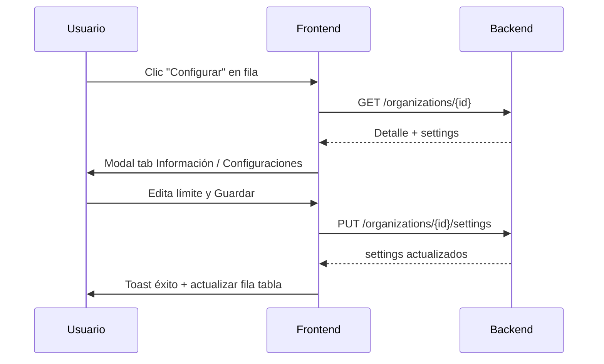

# Frontend — Configuración rápida de organizaciones (Admin)

Documento para integrar en la pantalla **Organizaciones** (listado con tabla, filtros, paginación y toggle de notificaciones).

---

## Objetivo

Agregar una acción por fila (ícono engranaje / “Configurar”) que abra un **modal con tabs**:

| Tab | Contenido |
|-----|-----------|
| **Información** | Datos básicos de la org + conteo de procesos activos |
| **Configuraciones** | Límite de radicados activos (primera setting; el modal debe poder crecer) |

La validación del límite la hace **siempre el backend** al registrar/importar/reactivar procesos. El frontend solo muestra y edita la configuración.

---

## Pantalla actual (referencia)

La tabla hoy incluye: `#`, `Nombre`, `Tipo`, `Identificación`, `Dirección`, `Teléfono`, `Correo`, `Persona de contacto`, `Notificaciones`, `Estado`, `Fecha de creación`.

**Propuesta UI:**

1. Nueva columna **Acciones** (o ícono al final de la fila): botón configurar.
2. Opcional: columna **Procesos** con formato `12 / 60` usando datos del listado (ver abajo).
3. Al hacer clic → modal con tabs **Información** | **Configuraciones**.

---

## Auth

Todos los endpoints requieren:

- Header `Authorization: Bearer {token}`
- Usuario admin (`auth:sanctum` + rol admin)

Base path API: `/api/admin`

---

## Endpoints

### 1) Listado (ya existente — campos nuevos)

```http
GET /api/admin/organizations?per_page=10&page=1
```

Cada ítem del paginador incluye **además de lo que ya consumen**:

| Campo | Tipo | Descripción |
|-------|------|-------------|
| `max_active_processes` | `number \| null` | Límite **efectivo** (override o default `.env`) |
| `default_max_active_processes` | `number \| null` | Default global del sistema (`.env`) |
| `active_processes_count` | `number` | Radicados activos distintos de la org |

**Uso en tabla (opcional):**

```text
{active_processes_count} / {max_active_processes ?? '∞'}
```

Si `max_active_processes` es `null` → ilimitado (mostrar `∞` o “Sin límite”).

---

### 2) Detalle para el modal (recomendado al abrir)

```http
GET /api/admin/organizations/{organizationId}
```

**Response 200:**

```json
{
  "id": "uuid",
  "name": "Ratke Group",
  "slug": "ratke-group",
  "type": "natural",
  "type_label": "Persona natural",
  "identification": "1234567890",
  "email": "contacto@ejemplo.com",
  "phone": "+57 3 0012 3456",
  "contact_person": null,
  "is_active": true,
  "active_processes_count": 12,
  "settings": {
    "max_active_processes": 60,
    "max_active_processes_configured": null,
    "default_max_active_processes": 60,
    "remaining_slots": 48
  }
}
```

#### Tab **Información**

Mostrar:

- Nombre (`name`)
- Tipo (`type_label`)
- Identificación, correo, teléfono, persona de contacto (si aplica)
- Estado (`is_active`)
- **Radicados activos:** `active_processes_count`
- **Límite efectivo:** `settings.max_active_processes` (o “Ilimitado” si `null`)

#### Tab **Configuraciones**

Objeto anidado `settings`:

| Campo | Tipo | Uso en UI |
|-------|------|-----------|
| `max_active_processes` | `number \| null` | Límite que **aplica hoy** el backend |
| `max_active_processes_configured` | `number \| null` | Valor guardado para esta org. `null` = **no tiene override** → usa default |
| `default_max_active_processes` | `number \| null` | Default del sistema (viene del backend, **no hardcodear en FE**) |
| `remaining_slots` | `number \| null` | Cupos restantes (`null` si ilimitado) |

**Textos sugeridos:**

- Si `max_active_processes_configured === null`:  
  *“Usando valor por defecto del sistema: {default_max_active_processes}”*
- Resumen: *“En uso: {active_processes_count} · Disponibles: {remaining_slots}”*

---

### 3) Guardar configuración

```http
PUT /api/admin/organizations/{organizationId}/settings
Content-Type: application/json

{
  "max_active_processes": 80
}
```

| Body | Efecto |
|------|--------|
| Entero `>= 0` | Guarda override para esa organización |
| `null` | Quita override → vuelve al default del `.env` |

**Importante:** la key `max_active_processes` debe ir **siempre presente** en el body (`present`).

**Response 200:**

```json
{
  "message": "Configuración de la organización actualizada.",
  "settings": {
    "organization_id": "uuid",
    "max_active_processes": 80,
    "max_active_processes_configured": 80,
    "default_max_active_processes": 60,
    "active_processes_count": 12,
    "remaining_slots": 68
  }
}
```

Alternativa solo settings (sin detalle completo):

```http
GET /api/admin/organizations/{organizationId}/settings
```

Misma forma que el objeto `settings` del PUT (más `organization_id`).

---

## Semántica del default (`.env` — solo backend)

El backend lee:

```env
ORGANIZATION_DEFAULT_MAX_ACTIVE_PROCESSES=60
```

| Situación | Límite efectivo |
|-----------|-----------------|
| Org con override `80` | **80** |
| Org sin override (`max_active_processes_configured === null`) | **60** (default `.env`) |
| Sin override y `.env` vacío | **Ilimitado** (`null`) |

**Ejemplo:** default = 60, org sin override, ya tiene 60 radicados activos → al intentar agregar el **61**, el backend responde **422**. El frontend no calcula esto; solo muestra el estado.

---

## Flujo recomendado en el modal



1. Clic en engranaje → `GET /organizations/{id}`.
2. Tab **Información**: solo lectura (por ahora).
3. Tab **Configuraciones**:
   - Input numérico “Límite de radicados activos”.
   - Valor inicial del input:  
     `max_active_processes_configured ?? default_max_active_processes ?? ''`
   - Checkbox/switch **“Usar valor por defecto del sistema”**:
     - Activado si `max_active_processes_configured === null`
     - Al guardar con switch ON → enviar `"max_active_processes": null`
     - Con switch OFF → enviar entero `>= 0`
4. Guardar → `PUT .../settings` → toast → refrescar fila (o re-fetch listado).
5. Cerrar modal.

---

## Validación frontend

| Regla | Detalle |
|-------|---------|
| Entero | `>= 0` cuando no se usa default |
| Default | Enviar `null` explícito, no omitir la key |
| Errores 422 | Mostrar `message` del backend (ej. límite alcanzado en otro flujo) |

Mensaje típico cuando se supera el cupo (registro/import, no en el modal):

> La organización alcanzó el límite de {limit} radicados activos (actualmente {current}).

---

## Tipos TypeScript (referencia)

```typescript
type OrganizationSettings = {
  max_active_processes: number | null;
  max_active_processes_configured: number | null;
  default_max_active_processes: number | null;
  remaining_slots: number | null;
};

type OrganizationListItem = {
  // ...campos existentes del listado
  max_active_processes: number | null;
  default_max_active_processes: number | null;
  active_processes_count: number;
};

type OrganizationDetail = {
  id: string;
  name: string;
  slug: string;
  type: 'natural' | 'juridical';
  type_label: string;
  identification: string | null;
  email: string | null;
  phone: string | null;
  contact_person: string | null;
  is_active: boolean;
  active_processes_count: number;
  settings: OrganizationSettings;
};
```

---

## Fuera de alcance (este ticket)

- Editar nombre, tipo, etc. desde el modal (solo lectura en tab Información).
- Configuraciones distintas al límite de radicados (llegarán en el mismo tab después).
- App user / pantallas de abogado.

---

## Checklist de implementación

- [ ] Columna o botón **Configurar** en cada fila de la tabla
- [ ] Modal con tabs **Información** | **Configuraciones**
- [ ] Al abrir: `GET /api/admin/organizations/{id}`
- [ ] Tab Configuraciones: input + switch “usar default del sistema”
- [ ] Guardar: `PUT /api/admin/organizations/{id}/settings`
- [ ] Mostrar `default_max_active_processes` del API (no hardcodear 60)
- [ ] Opcional: columna `active_processes_count / max_active_processes` en listado
- [ ] Tras guardar: actualizar fila y/o re-fetch paginado

---

## Contacto backend

Si falta algún campo en listado o detalle, coordinar antes de hardcodear defaults en el cliente.
